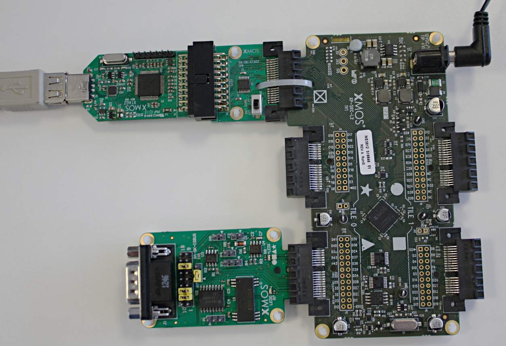

.. _CAN_Bus_Demo_Quickstart:

CAN Bus Demo Quickstart Guide
=============================

sc_can demo : Quick Start Guide
-------------------------------

This simple demonstration of xTIMEcomposer Studio functionality uses the XA-SK-ISBUS sliceCARD together with the 
xSOFTip ``module_can`` to demonstrate how the module is used to send and receive CAN Bus frames. The demonstration 
reports all traffic on the CAN bus until the demo is ended. Note: this demo requires a CAN to USB dongle for connecting
to the ISBUS slice. This is available from http://www.cananalyser.co.uk. The demonstration will run at 500Kb/s and 
support CAN 2.0A and 2.0B.

Hardware Setup
++++++++++++++

The XP-SKC-L2 sliceKIT core board has four slots with edge connectors: ``SQUARE``, ``CIRCLE``,``TRIANGLE`` and ``STAR``. 

To setup up the system:

   #. Connect XA-SK-ISBUS sliceCARD to the XP-SKC-L2 sliceKIT Core board using the connector marked with the ``TRIANGLE``.
   #. Connect the XTAG Adapter to sliceKIT Core board, and connect XTAG-2 to the Adapter. 
   #. Connect the XTAG-2 to host PC. Note that the USB cable is not provided with the sliceKIT starter kit.
   #. Set the ``XMOS LINK`` to ``ON`` on the XTAG Adapter.
   #. Switch on the power supply to the sliceKIT Core board.
   #. Connect the XA-SK-ISBUS to the CANdo USB interface via a DE-9 pass through cable.
   #. Set the jumpers on the ISBUS slice for CAN mode; P7 short between pins 1 and 2(leaving 3 unconnected), P6 short between 2 and 11, 3 and 12, 7 and 16. See hardware setup image for clarification.
   #. Install the CANdo application on a Windows machine and connect the CANdo dongle to that machine.
   #. Within the CANdo application:
           #. Click the ``CAN Setup`` tab and set the baud rate to 500k.
           #. Click ``View -> Options`` then ensure the ``Display On `CAN View` Page`` is checked. Then click ``OK``.
           #. Switch to the ``CAN View`` tab.
           #. Click the green run button.

   Hardware Setup for CAN Bus Demo
   
	
Import and Build the Application
++++++++++++++++++++++++++++++++

   #. Open xTIMEcomposer and check that it is operating in online mode. Open the edit perspective (Window->Open Perspective->XMOS Edit).
   #. Locate the ``'Slicekit CAN Bus Demo'`` item in the xSOFTip pane on the bottom left of the window and drag it into the Project Explorer window in the xTIMEcomposer. This will also cause the modules on which this application depends (in this case, ``module_can``) to be imported as well. 
   #. Click on the ``app_can_demo`` item in the Project Explorer pane then click on the build icon (hammer) in xTIMEcomposer. Check the console window to verify that the application has built successfully. There will be quite a number of warnings that ``bidirectional buffered port not supported in hardware``. These can be safely ignored for this component.

For help in using xTIMEcomposer, try the xTIMEcomposer tutorial, which you can find by selecting Help->Tutorials from the xTIMEcomposer menu.

Note that the Developer Column in the xTIMEcomposer on the right hand side of your screen provides information on the xSOFTip components you are using. Select the ``module_can`` component in the Project Explorer, and you will see its description together with API documentation. Having done this, click the `back` icon until you return to this quickstart guide within the Developer Column.

Run the Application
+++++++++++++++++++

Now that the application has been compiled, the next step is to run it on the sliceKIT Core Board using the tools to load the application over JTAG (via the xTAG and xTAG Adapter card) into the xCORE multi-core micro-controller.

   #. Select the file ``app_can_demo.xc`` in the ``app_can_demo`` project from the Project Explorer.
   #. Click ``Run -> Run Configurations`` then double click ``xCORE Application``.
   #. Select the new launch configuration named ``app_can_demo Debug`` and enable the ``Run XScope output server`` in the ``I/O Options``.
   #. Click the ``xSCOPE`` tab and under ``Mode`` select ``Offline [xSCOPE] Mode``.
   #. Click on the ``Run`` button.
   #. The debug console window in xTIMEcomposer should then display the frames as it transmits and receives them.
   #. To send a frame from the CANdo to the XA-SK-ISBUS enter a frame ID in the ``CAN Transmit Editor`` then click ``Now``.
   
The output from the application should look like::

  tx: 2E071	 : Ext	 : D 	0	
  tx: 190	 : Std	 : D 	6	C8	C9	44	6	72	93	
  tx: 151	 : Std	 : R 	7	
  tx: AE1F	 : Ext	 : D 	6	48	85	72	DE	46	BD	
 
    
Next Steps
++++++++++

Now that the demo has been run you could try and add filters to the can server. To do this add the line::

  can_add_filter(c_rx_tx, id);

before the ``while(1)`` loop, where ``id`` is the ID of the frame you want to filter out. After this filter has been applied the CAN server will receive all frames but not place filtered frames in the RX buffer.  

Look at the Code
................

   #. Examine the application code. In xTIMEcomposer navigate to the ``src`` directory under app_can_demo and double click on the ``app_can_demo.xc`` file within it. The file will open in the central editor window.
   #. Find the main function and note that it runs the ``application()`` function on a single logical core. 
   #. After transmitting a frame the application waits on the server for new frames or waits for a 5 second delay to end. This functionality is achieved using a ``select`` statement.
   #. The demo uses xSCOPE for fast printing. The user can switch to JTAG output but it will be slower.